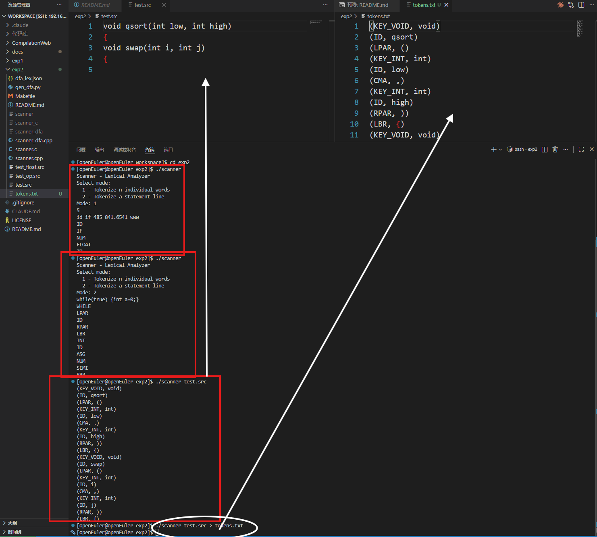
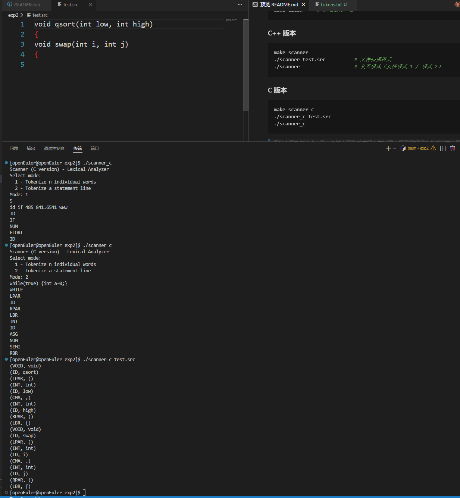
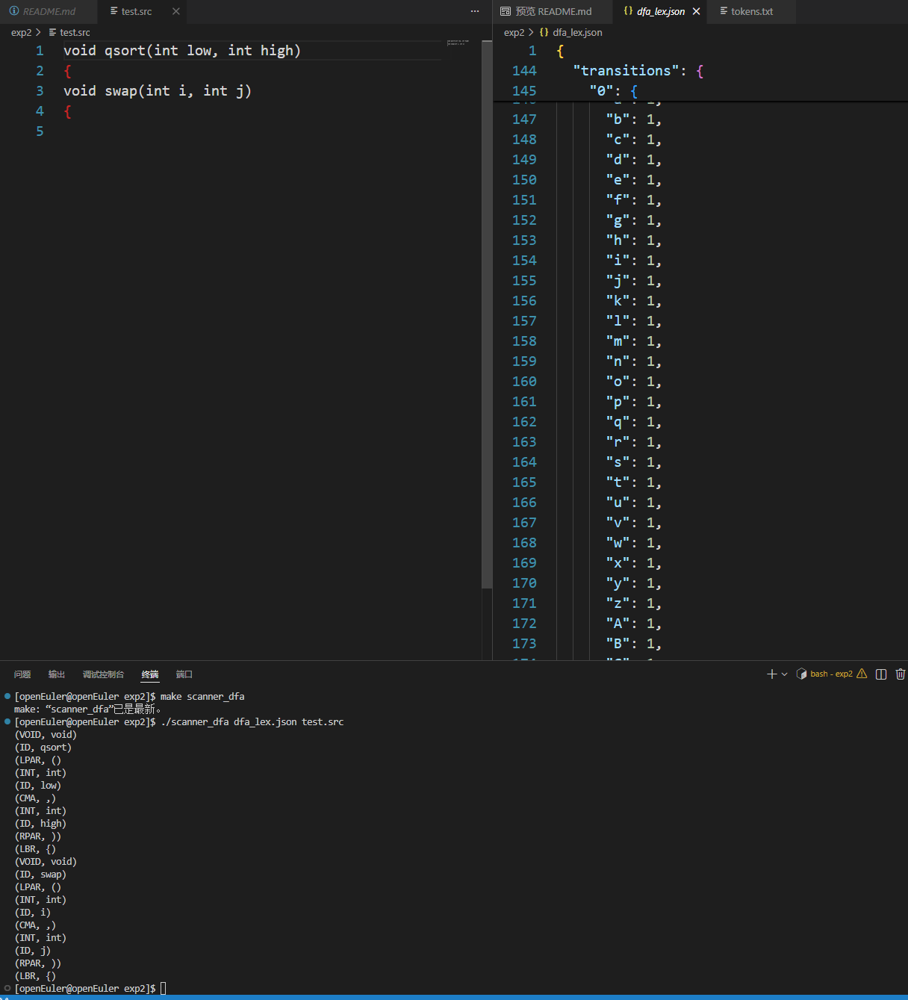
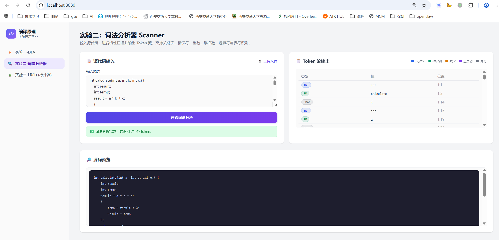

# 编译器设计专题实验课 — 实验二报告

## 一、实验目的

1. 理解词法分析器（Scanner）在编译器前端中的作用，掌握线性扫描、最长匹配、Token 识别等基本原理。
2. 实现一个能够识别自定义程序语言词法单元的 Scanner，支持关键字、标识符、整数、浮点数、运算符及界符。
3. **体现实验一与实验二的关联**：将实验一生成的 DFA 配置文件扩展并加载到实验二中，作为词法分析的规则文件驱动扫描过程。
4. 通过 C/C++ 命令行实现与 Web 可视化演示，全面掌握词法分析器的多平台实现方法。

---

## 二、实验环境

- **操作系统**：openEuler 22.03 LTS (aarch64，鲲鹏开发板)
- **编译器**：g++ 10.3.1（支持 C++17）、gcc 10.3.1（支持 C99）
- **构建工具**：GNU Make
- **Web 环境**：现代浏览器（Chrome / Firefox / Edge），Python3 简易 HTTP 服务器
- **项目仓库**：https://github.com/FreakWwjh/compiler-labs

---

## 三、实验原理

### 3.1 词法分析的前缀特性

程序设计语言的词法规则明确、无二义性，天然适合用 **DFA（确定有限自动机）** 识别。相比 NFA，DFA 无回溯、占用内存小，能够在 **O(n)** 时间内完成线性扫描，是词法分析器的理想模型。

### 3.2 主文法词法类别

本实验实现的 Scanner 支持以下 Token 类型：

| 类别 | 具体 Token | 说明 |
|------|-----------|------|
| 关键字 | `INT` `FLOAT` `VOID` `IF` `ELSE` `WHILE` `RETURN` `INPUT` `PRINT` | 保留字，区分大小写 |
| 标识符 | `ID` | 字母或下划线开头，后跟字母/数字/下划线 |
| 整型常量 | `NUM` | 纯数字序列 |
| 浮点常量 | `FLOAT` | 支持 `123.45`、`.66`、`1e-3`、`9.8E7` 等形式 |
| 算术运算符 | `ADD` `SUB` `MUL` `DIV` | `+` `-` `*` `/` |
| 关系运算符 | `LT` `LE` `EQ` `GT` `GE` `NE` | `<` `<=` `==` `>` `>=` `!=` |
| 赋值运算符 | `ASG` | `=` |
| 界符 | `SEMI` `LPAR` `RPAR` `LBR` `RBR` `LBK` `RBK` `CMA` | `;` `(` `)` `{` `}` `[` `]` `,` |

### 3.3 基于 DFA 的 Scanner 工作机制

实验回顾中明确指出：

> `dfa_in.dfa` 文件是实验一的输入，根据 DFA 表输出可接受字符流，**该文件在实验二中加载作为词法分析的规则文件**。

因此，本实验的核心设计是：

1. **扩展实验一的 DFA**：增加字母、数字、空格、等号、关系运算符等转移，使其覆盖主文法的全部字符；
2. **最长匹配算法**：从初始状态出发逐字符转移，记录最后一个接受状态的位置，无法继续时回退并输出 Token；
3. **关键字筛查**：DFA 统一识别为 `ID`，再通过查表区分为具体关键字类型。

---

## 四、实验过程与结果

### 4.1 C++ 版本实现与测试

采用 **C++17** 编写了直接编码的词法分析器 `scanner.cpp`，支持三种运行模式：

- **模式 1**：输入 `1` → 符号串个数 `n` → `n` 个单词，逐词输出类型；
- **模式 2**：输入 `2` → 一行语句，整句扫描输出 Token 序列；
- **文件模式**：`./scanner test.src`，批量扫描并输出 `(TYPE, value)` 格式。

编译与运行结果如下：

### 4.2 C 语言版本实现与测试

为深入理解底层字符处理机制，额外采用 **C99** 编写了功能完全等价的 `scanner.c`。通过手动管理缓冲区、枚举类型和字符指针操作，更直观地展示了词法分析的逐字符扫描过程。

### 4.3 DFA 驱动版本（实验一与实验二关联）

根据实验回顾要求，实现了 **`scanner_dfa.cpp`**，该程序**不硬编码任何 Token 规则**，而是完全依据实验一格式的 JSON 配置文件 `dfa_lex.json` 进行状态转移。

`dfa_lex.json` 包含 31 个状态、79 个符号，覆盖了标识符、整数、浮点数（含科学计数法）、全部运算符与界符。通过修改 JSON 即可扩展或修改词法规则，无需重新编译 Scanner。

### 4.4 Web 可视化选做成果

在实验一已搭建的 `CompilationWeb/` 平台上扩展了实验二模块，实现浏览器端实时词法分析：

- 左侧源码输入区支持直接编辑与文件上传（`.src`/`.c`/`.txt`）；
- 右侧 Token 流以表格形式展示，带**颜色区分**（关键字蓝、标识符绿、数字橙、运算符紫、界符灰）；
- 下方源码预览区带语法高亮。

---

## 五、实验总结

### 5.1 核心收获

1. **掌握了 Scanner 的完整实现链路**：从直接编码的字符状态机，到基于 DFA 配置表的通用驱动框架，理解了词法分析的“表驱动”设计思想。
2. **深刻理解了实验关联性**：实验一的 DFA 并非孤立存在，而是实验二词法分析的“规则引擎”。原始 DFA 若只包含 `a`、`0`、运算符，分析 `x = 42 + y` 会连续报错；必须扩展字符集和状态转移才能支持主文法。
3. **验证了最长匹配与回退机制**：特别是多字符运算符（`<=`、`==`、`!=`）和浮点数（`123.45`、`1e-3`）的识别，必须记录最后一个接受状态并正确回退指针。

### 5.2 三种实现的对比

| 实现方式 | 优点 | 适用场景 |
|---------|------|---------|
| `scanner.cpp` 直接编码 | 逻辑清晰、易于调试、执行效率高 | 教学理解、快速原型 |
| `scanner.c` 底层实现 | 贴近系统底层，无 STL 依赖 | 嵌入式、资源受限环境 |
| `scanner_dfa` 配置驱动 | 规则与代码分离，扩展性强 | 实际编译器前端、课程要求的实验关联 |
| Web 可视化 | 直观演示、跨平台、易于分享 | 教学演示、在线验收 |

---

## 六、开源信息

本项目作为编译原理课程实验的完整开源套件，已在 **GitHub** 上公开发布：

- **仓库地址**：https://github.com/FreakWwjh/compiler-labs
- **开源协议**：[MIT License](../LICENSE)
- **当前版本**：持续维护中，已完整收录实验一（DFA 模拟与可视化）与实验二（词法分析器 Scanner）的全部必做与选做内容。

**仓库亮点**：
- ✅ 实验一：C++ 命令行 DFA 模拟器 + Web 可视化（vis-network 图形化状态转移图）
- ✅ 实验二：C/C++ 双版本直接编码 Scanner + **DFA 配置驱动 Scanner** + Web 在线词法分析
- ✅ 所有代码均在 **openEuler aarch64（鲲鹏）** 环境下编译测试通过
- ✅ 提供完整的 Makefile、测试用例

