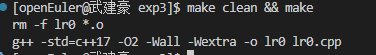
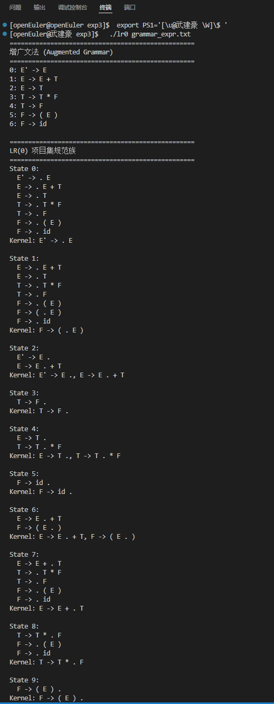
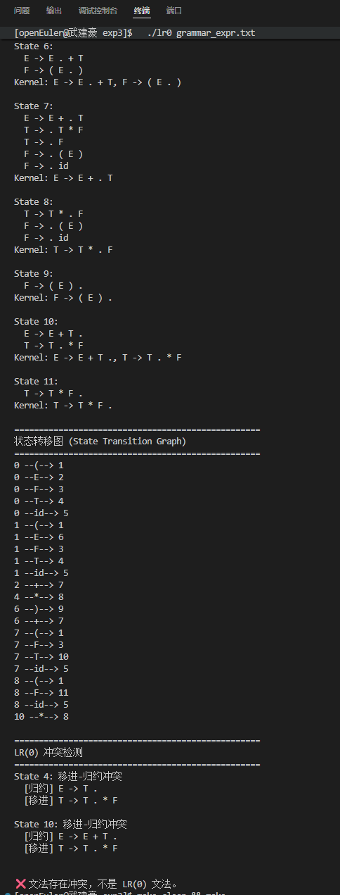
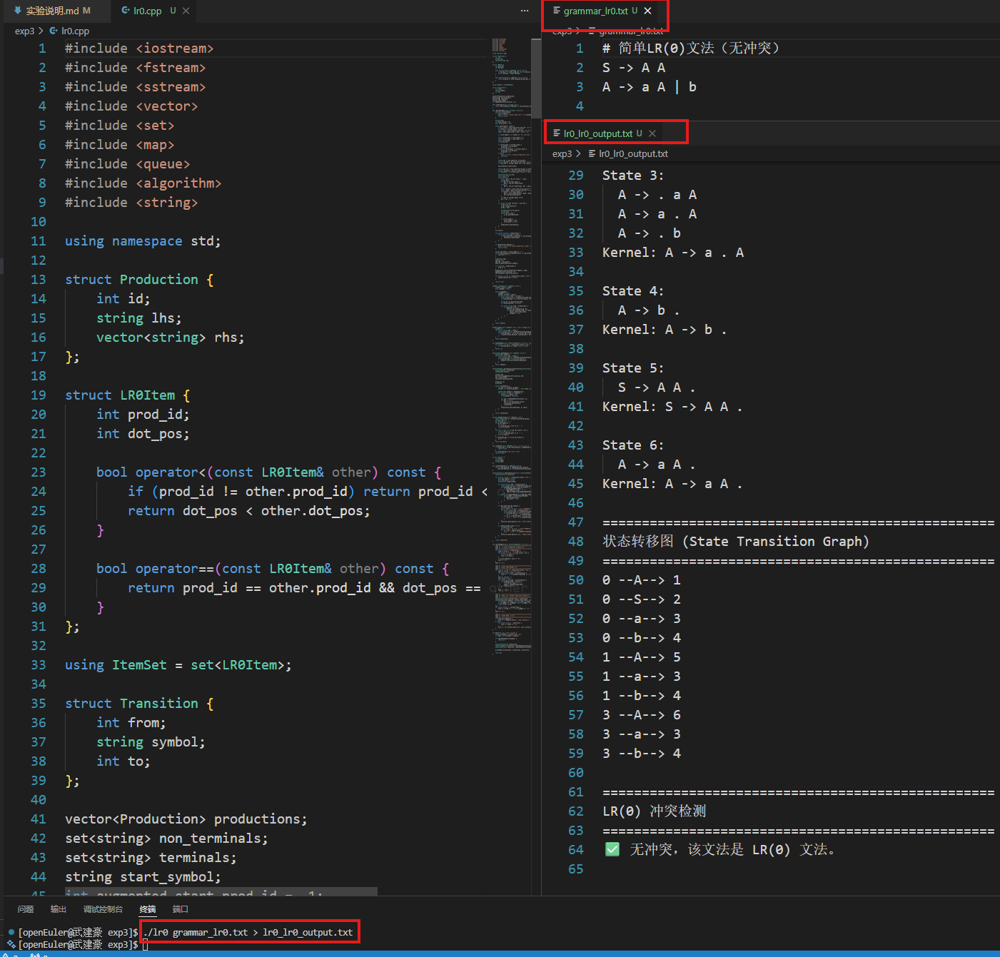

# 编译器设计专题实验课 — 实验三报告

## 一、实验目的

1. 理解自底向上语法分析的基本原理，掌握 LR(0) 项目、项目集、闭包（Closure）、转移（Goto）的核心概念。
2. 实现文法的自动增广、LR(0) 项目集规范族的自动构造算法。
3. 掌握 LR(0) 文法的判定方法：检测移进-归约冲突与归约-归约冲突。
4. 为实验四（SLR(1) 分析表生成）奠定数据结构基础。

---

## 二、实验环境

- **操作系统**：openEuler 22.03 LTS (aarch64，鲲鹏开发板)
- **编译器**：g++ 10.3.1（支持 C++17）
- **构建工具**：GNU Make
- **开发环境**：VS Code + 内置终端（Web IDE）
- **项目仓库**：https://github.com/FreakWwjh/compiler-labs

---

## 三、实验原理

### 3.1 LR(0) 项目

一个产生式右部某位置加上圆点，形如 `A -> α·β`，表示分析过程中已看到 α、期望看到 β。圆点的位置决定了当前分析器的状态。

### 3.2 闭包 (Closure)

对项目集 I，若包含 `A -> α·Bβ`（B 为非终结符），则将所有 `B -> ·γ` 加入 I，递归直到不再变化。闭包保证了项目集的完整性：任何可能被触发的子产生式都被预加载。

### 3.3 转移 (Goto)

```
Goto(I, X) = Closure({ A -> αX·β | A -> α·Xβ ∈ I })
```

即：从 I 中所有点后为 X 的项目出发，将圆点后移一位，再对新集合求闭包。

### 3.4 规范族构造算法

1. **增广文法**：添加 `S' -> S`，确保唯一的接受产生式。
2. **初始项目集**：`I₀ = Closure({S' -> ·S})`。
3. **BFS 扩展**：对每个项目集 I 和每个文法符号 X，计算 `J = Goto(I, X)`。若 J 非空且未出现过，则加入规范族并继续扩展。
4. **终止条件**：不再有新的项目集产生。

### 3.5 LR(0) 文法判定

- **移进项目**：圆点后为终结符（如 `A -> α·aβ`），对应移进（Shift）动作。
- **归约项目**：圆点在最右端（如 `B -> γ·`），对应归约（Reduce）动作。
- **接受项目**：增广产生式 `S' -> S·`，对应接受（Accept）动作，不参与冲突判定。
- **冲突类型**：
  - **移进-归约冲突**：同一状态中同时存在移进项目和归约项目。
  - **归约-归约冲突**：同一状态中存在多个不同的归约项目。

若存在上述任一冲突，则该文法**不是 LR(0) 文法**。

---

## 四、实验过程与结果

### 4.1 程序编译

在 openEuler aarch64（鲲鹏）环境下使用 g++ 10.3.1 编译，终端通过 `export PS1` 体现姓名标识。

```bash
export PS1='[\u@武建豪 \W]\$ '
make clean && make
```

编译结果：**零警告、零错误**，成功生成可执行文件 `lr0`。



### 4.2 标准表达式文法测试

测试文法 `grammar_expr.txt`（实验说明示例文法 A）：

```text
E -> E + T | T
T -> T * F | F
F -> ( E ) | id
```

运行命令：

```bash
./lr0 grammar_expr.txt
```

程序完整输出了增广文法、12 个 LR(0) 项目集（State 0 ~ State 11）、状态转移图以及冲突检测结论。由于终端输出较长，分两张截图展示：

**截图 1/2：增广文法及项目集 State 0 ~ State 9**



**截图 2/2：项目集 State 6 ~ State 11、状态转移图及冲突检测**



**输出结果摘要**：

```
==================================================
增广文法 (Augmented Grammar)
==================================================
0: E' -> E
1: E -> E + T
2: E -> T
3: T -> T * F
4: T -> F
5: F -> ( E )
6: F -> id

==================================================
LR(0) 项目集规范族
==================================================
State 0 ~ State 11  (共12个状态)

==================================================
状态转移图 (State Transition Graph)
==================================================
0 --(--> 1     0 --E--> 2     0 --F--> 3     0 --T--> 4     0 --id--> 5
1 --(--> 1     1 --E--> 6     1 --F--> 3     1 --T--> 4     1 --id--> 5
2 --+--> 7     4 --*--> 8     6 --)--> 9     6 --+--> 7     7 --(--> 1
7 --F--> 3     7 --T--> 10    7 --id--> 5    8 --(--> 1     8 --F--> 11
8 --id--> 5    10 --*--> 8

==================================================
LR(0) 冲突检测
==================================================
State 4: 移进-归约冲突
  [归约] E -> T .
  [移进] T -> T . * F

State 10: 移进-归约冲突
  [归约] E -> E + T .
  [移进] T -> T . * F

❌ 文法存在冲突，不是 LR(0) 文法。
```

**结果分析**：

标准表达式文法共生成 **12 个状态**。经检测，存在两处移进-归约冲突：

| 冲突状态 | 归约项目 | 移进项目 | 冲突原因 |
|:--------:|:---------|:---------|:---------|
| **State 4** | `E -> T .` | `T -> T . * F` | 遇到 `*` 时，既可以将 `T` 归约为 `E`，也可以继续移进 `*` 构建乘法表达式 |
| **State 10** | `E -> E + T .` | `T -> T . * F` | 遇到 `*` 时，既可以将 `E + T` 归约为 `E`，也可以将 `T` 继续扩展为 `T * F` |

这两处冲突的本质是 **运算符优先级与结合性** 在 LR(0) 框架下无法通过有限的前瞻信息区分。LR(0) 不查看输入符号的 FOLLOW 集，因此无法解决此类冲突，必须通过 SLR(1)、LR(1) 或 LALR(1) 等更强的分析方法。

### 4.3 简单 LR(0) 文法测试（无冲突验证）

为验证程序对无冲突文法的正确性，额外设计了简单 LR(0) 文法 `grammar_lr0.txt`：

```text
S -> A A
A -> a A | b
```

在 VS Code 终端中运行并验证：

```bash
./lr0 grammar_lr0.txt
```

该文法共生成 **7 个状态**，冲突检测结论为：

```
✅ 无冲突，该文法是 LR(0) 文法。
```



该文法满足 LR(0) 的要求：每个状态中要么只有移进/转移项目，要么只有唯一的归约项目，不存在任何冲突。此测试证明了程序不仅能正确检测冲突，也能正确判定无冲突的 LR(0) 文法。

---

## 五、实验总结

### 5.1 核心收获

1. **深入理解了 Closure 与 Goto 的递归构造过程**：Closure 体现了“期望看到”的语义——一旦分析器期望某个非终结符，就必须预加载该非终结符的所有产生式；Goto 则体现了“已经看到”的推进——将圆点后移，进入下一个分析阶段。从 `I₀` 出发，通过 BFS 反复应用 Closure 和 Goto，最终得到完整的规范族。

2. **掌握了 LR(0) 的局限性**：即使是简单的四则运算表达式文法，在 LR(0) 框架下也存在移进-归约冲突（State 4 和 State 10）。这是因为 LR(0) 在决定是否归约时完全不考虑当前输入符号（lookahead），而仅依赖状态本身。这正是 SLR(1) 引入 FOLLOW 集、LR(1) 引入 lookahead 符号的根本原因。

3. **从工程角度实现了完整的规范族生成器**：代码层面利用 `std::set<LR0Item>` 天然去重和有序的特性，保证了项目集的规范表示；通过 BFS 队列驱动规范族的扩展，确保了状态编号的有序性；通过拷贝而非引用避免了 `vector` 重新分配导致的悬空引用问题（这是调试中遇到的实际 bug）。

### 5.2 关键代码设计

| 设计点 | 说明 |
|--------|------|
| `LR0Item` 用 `(prod_id, dot_pos)` 二元组表示 | 内存紧凑、支持 `set` 的快速比较与去重 |
| `ItemSet` 用 `std::set<LR0Item>` | 天然去重、字典序输出，便于状态等价判断 |
| 规范族用 `std::vector<ItemSet>` + BFS | 保证 I₀, I₁, ... 的顺序编号，支持 `findItemSet` 线性查找 |
| 增广文法自动插入 productions[0] | 与教材和实验说明的编号习惯一致（0 号为 S' -> S） |
| 接受项目排除冲突检测 | 增广产生式 `S' -> S·` 视为 Accept，不视为 Reduce，与标准 LR(0) 定义一致 |
| `vector` 重新分配安全 | `ItemSet I = collection[idx]` 采用拷贝，避免 `push_back` 引发引用悬空 |

### 5.3 与实验二、实验四的关联

- **实验二（词法分析）** 的输出 Token 流（如 `id`、`+`、`(` 等）正是本实验文法中的终结符。实验三的文法规则建立在实验二已识别的 Token 类别之上。
- **实验四（SLR(1) 分析表）** 将以本实验的输出（LR(0) 项目集规范族 + 转移关系）为基础，结合非终结符的 FOLLOW 集，生成 ACTION/GOTO 表，从而解决本实验中发现的移进-归约冲突。

---

## 六、开源信息

本项目作为编译原理课程实验的完整开源套件，已在 **GitHub** 上公开发布：

- **仓库地址**：https://github.com/FreakWwjh/compiler-labs
- **开源协议**：[MIT License](../LICENSE)
- **当前版本**：持续维护中，已完整收录：
  - ✅ 实验一：DFA 模拟与 Web 可视化
  - ✅ 实验二：词法分析器 Scanner（C/C++ 双版本 + DFA 驱动）
  - ✅ 实验三：LR(0) 项目集规范族自动生成器

**实验三收录内容**：
- C++17 实现 LR(0) 项目集规范族自动生成
- 支持扩展巴科斯范式文法输入（`->`、`→`、`|`）
- 自动增广文法、Closure、Goto 完整算法
- 移进-归约 / 归约-归约冲突检测（接受项目智能排除）
- 格式化报告输出（增广文法、项目集、转移图、冲突结论）
- 提供标准表达式文法、扩展文法、简单 LR(0) 文法三套测试用例
- 所有代码在 **openEuler aarch64（鲲鹏）** 环境下编译测试通过

---

*报告完成日期：2026/05/28*
