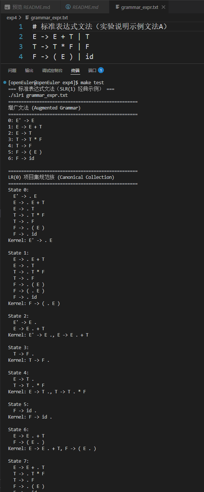
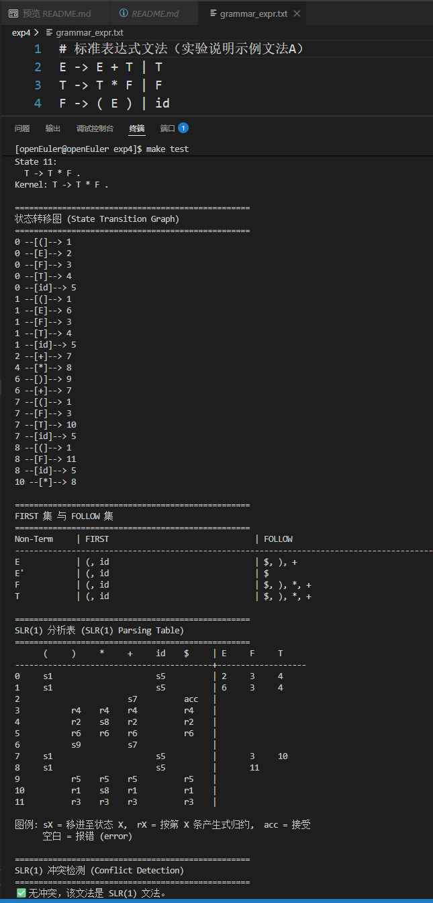
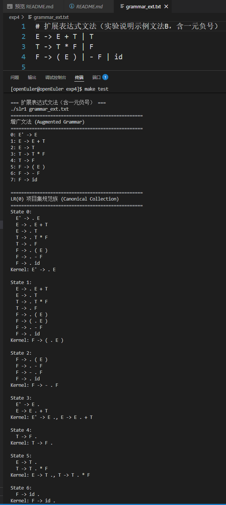
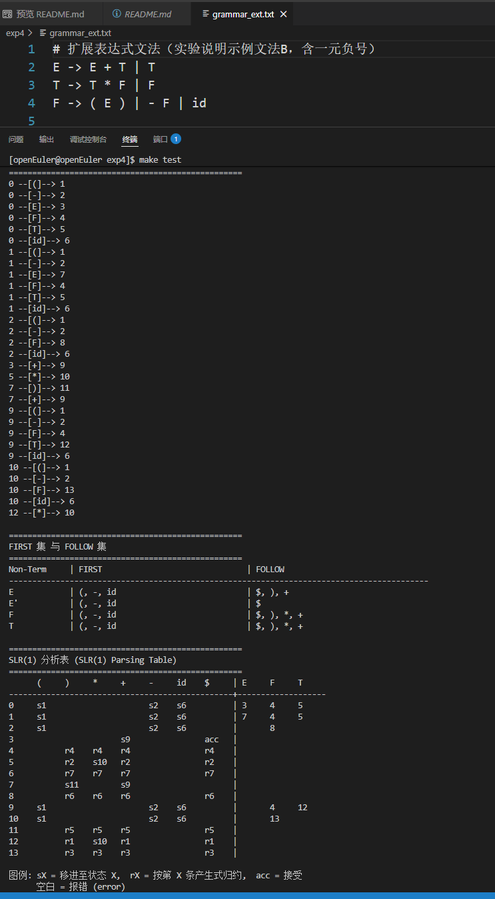
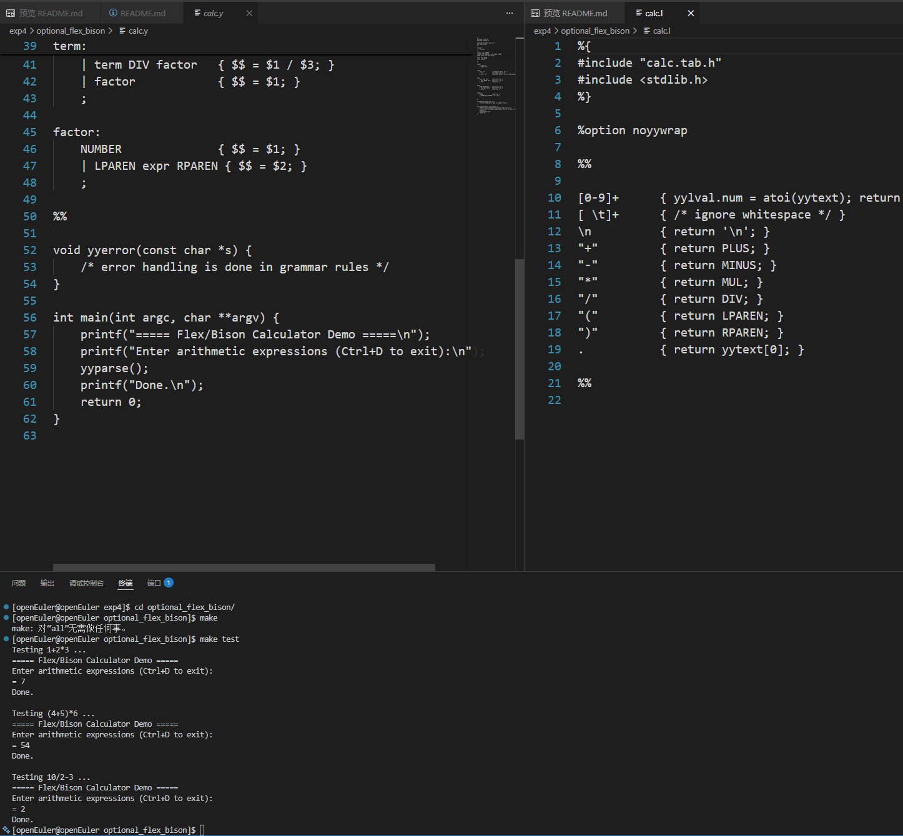

# 编译器设计专题实验课 — 实验四报告

## 一、实验目的

1. 理解 SLR(1) 分析法的核心思想：在 LR(0) 项目集规范族的基础上，利用 **FOLLOW 集** 作为前瞻信息，解决部分移进-归约 / 归约-归约冲突。
2. 掌握 FIRST 集与 FOLLOW 集的系统化计算方法（不动点迭代），并能正确用于指导 SLR(1) 分析表的填写。
3. 实现完整的 **SLR(1) 分析表生成器**：输入上下文无关文法，自动输出 ACTION/GOTO 二维表，并判定是否为 SLR(1) 文法。
4. 通过对比手工实现的 SLR(1) 分析器与 Flex/Bison 自动工具，体会编译器生成器的设计思想与工程价值。

---

## 二、实验环境

- **操作系统**：openEuler 22.03 LTS (aarch64，鲲鹏开发板)
- **编译器**：g++ 10.3.1（支持 C++17）
- **构建工具**：GNU Make
- **开发环境**：VS Code + 内置终端（Web IDE）
- **自动化工具**：Flex 2.6.4、Bison 3.8.2
- **项目仓库**：https://github.com/FreakWwjh/compiler-labs

---

## 三、实验原理

### 3.1 LR(0) 的局限与 SLR(1) 的改进

实验三已经证明：标准表达式文法在 LR(0) 框架下存在 **移进-归约冲突**（State 4 和 State 10）。其根本原因是 LR(0) 在决定是否归约时完全不查看当前输入符号，仅依赖状态本身。

SLR(1) 引入 **FOLLOW 集** 作为归约的约束条件：
- 对于归约项目 `A -> α·`，仅在 **当前输入符号 `a ∈ FOLLOW(A)`** 时才执行归约动作 `r`。
- 若 `a ∉ FOLLOW(A)`，则即使状态中包含 `A -> α·`，也不填归约动作，从而避免与移进项目冲突。

### 3.2 FIRST 集计算

**定义**：`FIRST(α)` 表示从符号串 `α` 能推导出的所有句型的首终结符集合。若 `α ⇒* ε`，则 `ε ∈ FIRST(α)`。

**算法**（不动点迭代）：
1. 对每个终结符 `a`，`FIRST(a) = {a}`。
2. 对非终结符 `A`：
   - 若 `A -> ε`，则 `ε ∈ FIRST(A)`。
   - 若 `A -> X₁X₂...Xₙ`，依次将 `FIRST(Xᵢ)\{ε}` 加入 `FIRST(A)`，直到某个 `Xᵢ` 不含 `ε`；若全部含 `ε`，则 `ε ∈ FIRST(A)`。
3. 重复步骤 2，直到所有集合不再变化。

### 3.3 FOLLOW 集计算

**定义**：`FOLLOW(A)` 表示在句型中紧跟非终结符 `A` 后面的终结符集合，`$`（输入结束符）总是属于开始符号的 FOLLOW 集。

**算法**（不动点迭代）：
1. `FOLLOW(S') = {$}`（`S'` 为增广开始符号）。
2. 对每个产生式 `A -> αBβ`：
   - `FIRST(β)\{ε} ⊆ FOLLOW(B)`。
   - 若 `β` 为空或 `β ⇒* ε`，则 `FOLLOW(A) ⊆ FOLLOW(B)`。
3. 重复步骤 2，直到所有集合不再变化。

### 3.4 SLR(1) 分析表构造规则

设 `I₀, I₁, ..., Iₙ` 为 LR(0) 项目集规范族，对状态 `i`：

| 项目类型 | 操作 |
|---------|------|
| `A -> α·aβ`（`a` 为终结符），且 `goto(Iᵢ, a) = Iⱼ` | `ACTION[i, a] = sj`（移进至状态 j）|
| `A -> α·`（`A ≠ S'`），产生式编号 `j` | 对所有 `x ∈ FOLLOW(A)`：`ACTION[i, x] = rj`（按第 j 条产生式归约）|
| `S' -> S·`（接受项目） | `ACTION[i, $] = acc` |
| `goto(Iᵢ, A) = Iⱼ`（`A` 为非终结符） | `GOTO[i, A] = j` |

**冲突判定**：若同一 `ACTION[i, a]` 格子被填入不同操作，则存在 **移进-归约冲突** 或 **归约-归约冲突**，该文法不是 SLR(1) 文法。

### 3.5 Flex / Bison 自动工具原理

- **Flex**：根据正则表达式规则自动生成有限自动机（DFA），将字符流转换为 Token 序列。
- **Bison**：根据上下文无关文法规则自动构造 LR(1) / LALR(1) 分析表，通过移进-归约自动机完成语法分析，并支持在产生式中嵌入语义动作（如求值、建 AST）。
- 与手工 SLR(1) 相比，Flex/Bison 无需手动计算 Closure、Goto、FIRST、FOLLOW，而是通过声明优先级、结合性自动解决冲突，极大提高了编译器前端开发效率。

---

## 四、实验过程与结果

### 4.1 程序编译

在 openEuler aarch64（鲲鹏）环境下使用 g++ 10.3.1 编译，终端通过 `export PS1` 体现姓名标识。

```bash
export PS1='[\u@武建豪 \W]\$ '
cd exp4
make clean && make
```

编译结果：**零警告、零错误**，成功生成可执行文件 `slr1`。

### 4.2 标准表达式文法测试

测试文法 `grammar_expr.txt`（实验说明示例文法 A）：

```text
E -> E + T | T
T -> T * F | F
F -> ( E ) | id
```

运行命令：

```bash
./slr1 grammar_expr.txt
```

该文法共生成 **12 个状态**，完整输出了 LR(0) 项目集规范族、状态转移图、FIRST/FOLLOW 集、SLR(1) 分析表及冲突检测结论。

**截图 1/2：增广文法、项目集 State 0 ~ State 7**



**截图 2/2：项目集 State 8 ~ State 11、状态转移图、FIRST/FOLLOW 集、SLR(1) 分析表**



**输出结果摘要**：

```
==================================================
增广文法 (Augmented Grammar)
==================================================
0: E' -> E
1: E -> E + T
2: E -> T
3: T -> T * F
4: T -> F
5: F -> ( E )
6: F -> id

==================================================
FIRST 集 与 FOLLOW 集
==================================================
E  : FIRST = { (, id }     FOLLOW = { $, ), + }
E' : FIRST = { (, id }     FOLLOW = { $ }
F  : FIRST = { (, id }     FOLLOW = { $, ), *, + }
T  : FIRST = { (, id }     FOLLOW = { $, ), *, + }

==================================================
SLR(1) 分析表 (SLR(1) Parsing Table)
==================================================
      (     )     *     +     id    $     | E     F     T
------------------------------------------+-------------------
0     s1                      s5          | 2     3     4
1     s1                      s5          | 6     3     4
2                       s7          acc   |
3           r4    r4    r4          r4    |
4           r2    s8    r2          r2    |
5           r6    r6    r6          r6    |
6           s9          s7                |
7     s1                      s5          |       3     10
8     s1                      s5          |       11
9           r5    r5    r5          r5    |
10          r1    s8    r1          r1    |
11          r3    r3    r3          r3    |

==================================================
SLR(1) 冲突检测 (Conflict Detection)
==================================================
✅ 无冲突，该文法是 SLR(1) 文法。
```

**结果分析**：

与实验三相比，标准表达式文法在 LR(0) 中存在 **State 4**（`E -> T .` 与 `T -> T . * F`）和 **State 10**（`E -> E + T .` 与 `T -> T . * F`）两处移进-归约冲突。引入 FOLLOW 集后：

- `FOLLOW(E) = { $, ), + }`，不包含 `*`，因此 State 4 和 State 10 中遇到 `*` 时**只移进、不归约**，冲突被完美消解。
- 同理，`FOLLOW(T) = { $, ), *, + }`，State 3 中 `T -> F .` 在这些符号上归约（`r4`），State 5 中 `F -> id .` 也在这些符号上归约（`r6`），互不冲突。

这充分验证了 SLR(1) 的核心思想：**归约动作只在 FOLLOW 集对应的列上填写**，从而将 LR(0) 中“无差别归约”导致的冲突精确消除。

### 4.3 扩展表达式文法测试（含一元负号）

测试文法 `grammar_ext.txt`（实验说明示例文法 B）：

```text
E -> E + T | T
T -> T * F | F
F -> ( E ) | - F | id
```

运行命令：

```bash
./slr1 grammar_ext.txt
```

该文法共生成 **14 个状态**，在标准表达式文法基础上增加了对一元负号 `-F` 的支持。

**截图 1/2：增广文法、项目集 State 0 ~ State 6**



**截图 2/2：状态转移图、FIRST/FOLLOW 集、SLR(1) 分析表**



**关键观察**：

- 新增产生式 `F -> - F` 引入了新的状态（State 2：`F -> - . F`），以及状态 1、9、10 中的 `[-]-->` 转移。
- `FOLLOW(F) = { $, ), *, + }` 不变，因为 `-` 作为前缀运算符出现在产生式右部，不影响 F 的 FOLLOW 集。
- 冲突检测结论仍为 **无冲突**，证明 SLR(1) 能够正确处理一元运算符的扩展。

### 4.4 简单 LR(0) 文法测试（无冲突验证）

测试文法 `grammar_lr0.txt`：

```text
S -> A A
A -> a A | b
```

运行命令：

```bash
./slr1 grammar_lr0.txt
```

该文法共生成 **7 个状态**，同时是 LR(0) 文法和 SLR(1) 文法。

**截图 1/2：增广文法、项目集 State 0 ~ State 4**

%20文法-1.png)

**截图 2/2：项目集 State 5 ~ State 6、状态转移图、FIRST/FOLLOW 集、SLR(1) 分析表**

%20文法-2.png)

**结果分析**：

- `FOLLOW(A) = { $, a, b }`，因为 `S -> A A` 中第一个 `A` 后面紧跟第二个 `A`（`FIRST(A)\{ε} = {a, b}`），且 `A` 不能推 `ε`，所以 `FOLLOW(A)` 还包含 `FOLLOW(S) = {$}`。
- SLR(1) 分析表中，State 4（`A -> b .`）在 `a, b, $` 上均填 `r3`；State 6（`A -> a A .`）在 `a, b, $` 上均填 `r2`；State 5（`S -> A A .`）仅在 `$` 上填 `r1`。
- 所有动作无重叠，**无冲突**，验证了程序对简单文法的正确性。

### 4.5 选做：Flex / Bison 自动工具体验

进入 `optional_flex_bison/` 目录，实现了一个简单的 **算术表达式计算器**，体验自动化编译器前端工具。

**截图：calc.y / calc.l 源码与编译测试**



**实现内容**：

- **`calc.l`**（Flex 词法规则）：使用正则表达式识别数字 `[0-9]+`、运算符 `+ - * /`、括号 `(` `)`，返回对应的 Token 类型。
- **`calc.y`**（Bison 语法规则）：定义表达式文法，通过 `%left` 声明运算符优先级与结合性，Bison 自动解决移进-归约冲突；在归约时执行语义动作（`$$ = $1 + $3` 等），实时计算表达式值。

**测试结果**：

```bash
cd optional_flex_bison
make clean && make && make test
```

输出：
- `1+2*3 = 7`
- `(4+5)*6 = 54`
- `10/2-3 = 2`

**对比体会**：

| 特性 | 手工 SLR(1) | Flex/Bison |
|------|------------|------------|
| 词法分析 | 手写 DFA / 状态转移 | Flex 正则自动生成 DFA |
| 语法分析 | 手动计算 Closure/Goto/填表 | Bison 自动构造 LALR(1) 分析表 |
| 冲突解决 | 手动用 FOLLOW 集判断 | 声明优先级/结合性自动解决 |
| 语义动作 | 自行设计属性栈 | Bison 自动维护值栈 (`$$`, `$1`...) |
| 可维护性 | 修改文法需重写大量代码 | 修改 `.y`/`.l` 后重新生成即可 |

通过本次体验，深刻理解了为什么现代编译器（如 GCC、Clang）的前端普遍采用类似工具链：它们将繁琐的表构造和冲突分析自动化，使开发者能聚焦于语言特性本身。

---

## 五、实验总结

### 5.1 核心收获

1. **FIRST/FOLLOW 集是连接词法与语法的桥梁**：FIRST 集决定了在推导过程中“期望看到什么”，FOLLOW 集决定了在归约时“允许看到什么”。两者的不动点迭代算法虽然概念简单，但实现时必须仔细处理 `ε` 产生式和递归依赖，否则容易导致集合遗漏。

2. **SLR(1) 是 LR(0) 的精炼而非革命**：SLR(1) 并没有改变 LR(0) 的项目集规范族结构，只是在填表时增加了 FOLLOW 集的约束。这种“保守扩展”的设计思想非常值得借鉴：在已有数据结构（LR(0) 规范族）上增加有限的前瞻信息，即可显著提升分析能力。

3. **验证了标准表达式文法的 SLR(1) 性质**：实验三中 LR(0) 的两处移进-归约冲突（State 4 和 State 10）在 SLR(1) 框架下被完全消除。原因在于 `*` 不属于 `FOLLOW(E)`，因此遇到 `*` 时分析器只会移进，不会将 `E` 或 `E+T` 贸然归约。

4. **Flex/Bison 体现了“声明式”编程的优势**：手工实现 SLR(1) 需要数百行代码和复杂的集合运算，而 Flex/Bison 只需几十行规则声明即可完成同等功能。这印证了编译原理课程中“自动化工具是工程实践首选”的结论。

### 5.2 关键代码设计

| 设计点 | 说明 |
|--------|------|
| `computeFirst()` / `computeFollow()` 不动点迭代 | 使用 `std::set` 的 `insert` 返回值判断变化，直至收敛 |
| `getFirstOfSequence()` | 计算符号串的 FIRST 集，用于 FOLLOW 推导中 `β` 的处理 |
| `buildSLRTable()` | 遍历 LR(0) 项目集，根据项目类型分别填 ACTION（移进/归约/接受）和 GOTO |
| 冲突检测 | 同一 `ACTION[i][a]` 被重复填入不同值时记录冲突类型与状态 |
| 转移图输出 `0 --[X]--> 1` | 使用方括号包裹符号，避免 `-` 等符号与分隔线混淆 |
| 增广产生式智能排除 | `S' -> S·` 只填 `acc`，不参与归约冲突检测 |

### 5.3 与实验三、实验五的关联

- **实验三（LR(0)）**：本实验完全复用了实验三的 LR(0) 项目集规范族生成代码。实验三检测到的 LR(0) 冲突，正是本实验 SLR(1) 需要解决的核心问题。
- **实验五（语义分析）**：实验五将在 SLR(1) 语法分析的基础上，集成语义动作、构建 AST、维护符号表。本实验生成的 ACTION/GOTO 表是实验五语法分析驱动器的核心数据结构。

---

## 六、开源信息

本项目作为编译原理课程实验的完整开源套件，已在 **GitHub** 上公开发布：

- **仓库地址**：https://github.com/FreakWwjh/compiler-labs
- **开源协议**：[MIT License](../../LICENSE)
- **当前版本**：持续维护中，已完整收录：
  - ✅ 实验一：DFA 模拟与 Web 可视化
  - ✅ 实验二：词法分析器 Scanner（C/C++ 双版本 + DFA 驱动）
  - ✅ 实验三：LR(0) 项目集规范族自动生成器
  - ✅ 实验四：SLR(1) 分析表生成器 + Flex/Bison 体验

**实验四收录内容**：
- C++17 实现 SLR(1) 分析表自动生成器
- 支持扩展巴科斯范式文法输入（`->`、`→`、`|`）
- 自动增广文法、Closure、Goto 完整算法（复用并扩展实验三）
- FIRST 集与 FOLLOW 集的不动点迭代计算
- ACTION/GOTO 二维表自动构造与格式化输出
- SLR(1) 移进-归约 / 归约-归约冲突检测
- 标准表达式文法、扩展表达式文法、简单 LR(0) 文法三套测试用例
- **选做**：Flex + Bison 表达式计算器完整示例
- 所有代码在 **openEuler aarch64（鲲鹏）** 环境下编译测试通过

---

*报告完成日期：2026/05/30*
